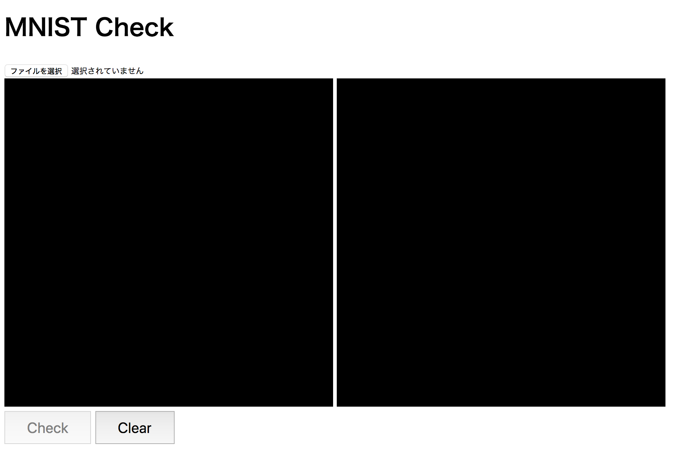
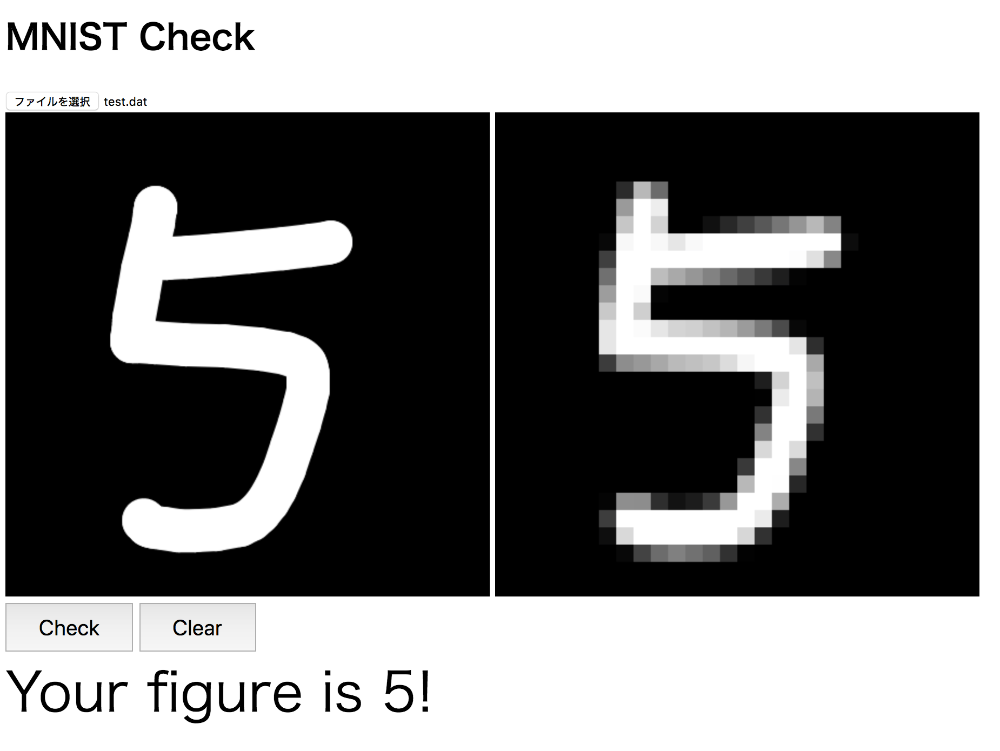

# MNIST Check by JavaScript

## Summary

1. Train a model for MNIST data set using Chainer.
2. Export the model.
3. Import the model by JavaScript
4. Then you can test the model by your hand-written figures!

You need [Chainer](https://chainer.org/).

## Usage

    $ python train.py  # Train a model for MNIST data set using Chainer
    $ python export.py # Convert test.model to test.dat

Then open `check.html` by a browser. You will see the following.

First, the check button is disabled. Please load the trained model "test.dat". Then the check button is enabled.

Write some figures on the left canvas. The right canvas is the image which will be passed to the model.

Push the check button. The model will recognize your figure.

Enjoy!
