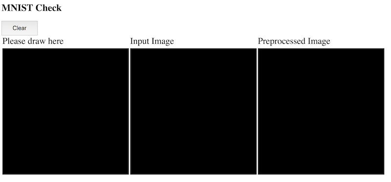
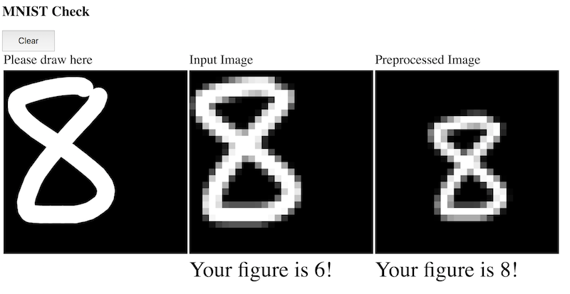

# MNIST Check by JavaScript

## Summary

1. Train a model for MNIST data set using Chainer.
2. Export the model.
3. Import the model by JavaScript
4. Then you can test the model by your hand-written figures!

You can try it onle [here](https://kaityo256.github.io/mnist_check/).

An explanation article written in Japanese is [here](https://qiita.com/kaityo256/items/4ac935547afc8ba97f66).

## Requirement

You need [Chainer](https://chainer.org/).

## Usage

    $ python train.py  # Train a model for MNIST data set using Chainer
    $ python export.py # Convert test.model to test.dat
    $ cp test.dat docs

Then open `docs/index.html` by a browser. You will see the following.

Proper permission is necessary to load local file by `XMLHttpRequest`.
For example, you need `--allow-file-access-from-files` option for Chrome. Firefox is OK by default.

Write some figures on the left canvas. The middle canvas is the image which will be passed to the model. The right canvas shows an image which is preprocessed so that the center of mass of the image comes to the center.

After you write a figure, the trained model will guess your figure. As you will see, the data with preprocess exhibits better accuracy.

Enjoy!
